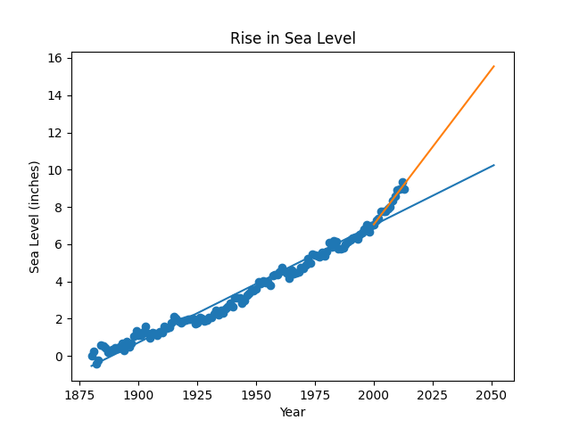

# Sea Level Predictor 
This project is part of the Data Analysis with Python cretification from FreeCodeCamp.
This project analyzes historical sea-level data and predicts future trends using statistical modeling. The data is visualized through scatter plots and lines of best fit, highlighting long-term and post-2000 trends. This analysis provides insights into how sea levels may rise in the coming decades.

## Methodology
1. **Data Exploration**: Inspect the dataset and check for missing values or anomalies.
2. **Visualization**: Create scatter plots to represent historical data.
3. **Statistical Modeling**:
   - Generate a line of best fit for the entire dataset.
   - Generate a second line of best fit using data from 2000 onward.
4. **Prediction**: Use the models to predict sea levels up to 2050.

## Results
- The overall trend shows a steady increase in sea level over the past century.
- Post-2000 data indicates an accelerated rise in sea level.
- Predictions suggest that sea levels may rise by up to 6 inches.

